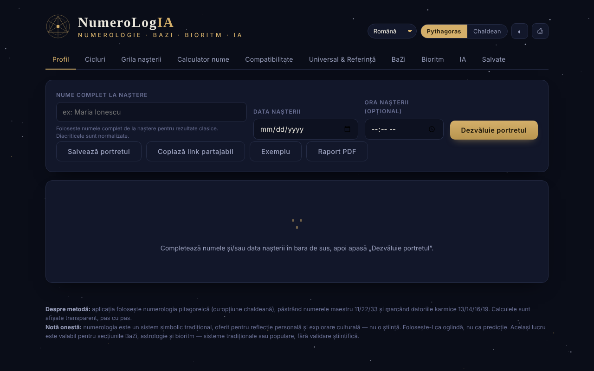

# NumeroLogIA

Numerologie pitagoreică și chaldeană, cu analiză a ciclurilor, compatibilitate și un oracol IA opțional care rulează pe modelul tău local.

**Live:** https://chiuta.github.io/NumeroLogIA/

## Ce este

NumeroLogIA calculează un „portret” numerologic pornind de la numele complet de la naștere, data nașterii și, opțional, ora nașterii. Aplicația folosește numerologia pitagoreică (cu opțiune chaldeană), păstrează numerele maestru 11/22/33 și marchează datoriile karmice 13/14/16/19; calculele sunt afișate pas cu pas. Aplicația precizează explicit că numerologia este un sistem simbolic tradițional, oferit pentru reflecție personală și explorare culturală, nu o știință.

## Funcții

- Interfață în 7 limbi: engleză, română, italiană, spaniolă, franceză, portugheză, catalană.
- Comutator de sistem **Pythagoras / Chaldean**; temă deschisă/închisă (butonul ◐); **⎙** pentru tipărire / salvare PDF.
- File: **Profil**, **Cicluri**, **Grila nașterii**, **Calculator nume**, **Compatibilitate**, **Universal & Referință**, **BaZi**, **Bioritm**, **IA**, **Salvate**.
- Butoane în Profil: **Dezvăluie portretul**, **Salvează portretul**, **Copiază link partajabil**, **Exemplu**, **Raport PDF**.
- Calculator de valoare numerică pentru orice nume sau cuvânt, defalcat literă cu literă (vocale și consoane), în ambele sisteme, și compararea a două nume (nume de scenă, după căsătorie, pseudonime).
- Compatibilitate între două persoane (Drumul Vieții, Expresia, Dorința Sufletului).
- Numerele universale ale zilei și o referință completă a numerelor.
- **Portrete salvate** în browser.
- **Oracol IA** (opțional): sinteză de portret, ghidaj pentru azi, interpretare de compatibilitate și întrebări libere, trimise către un model lingvistic la o adresă pe care o setezi tu (implicit Ollama local). Poate lista modele instalate și descărca modele prin Ollama.

## Manual de utilizare

1. Alege limba din lista de limbi și sistemul (Pythagoras sau Chaldean).
2. În „Profil”, introdu numele complet de la naștere (diacriticele sunt normalizate), data nașterii și, dacă vrei, ora; apasă **Dezvăluie portretul** (Enter în câmpuri face același lucru). **Exemplu** completează date demonstrative.
3. Parcurge filele Cicluri, Grila nașterii, BaZi și Bioritm pentru restul analizei.
4. Pentru un cuvânt oarecare, folosește „Calculator nume”; pentru două persoane, „Compatibilitate”.
5. **Salvează portretul** îl păstrează în fila „Salvate”; **Copiază link partajabil** pune în link numele, data, ora, limba și sistemul.
6. **Raport PDF** sau **⎙** deschid dialogul de tipărire al browserului, de unde poți salva PDF.
7. Pentru fila IA: instalează Ollama (sau alt server compatibil OpenAI), pornește un model, deschide „Setări”, verifică adresa (implicit `http://localhost:11434/v1`) și modelul, apasă salvare / test, apoi alege o acțiune. Dacă pagina este servită de pe un site, aplicația indică pornirea Ollama cu `OLLAMA_ORIGINS=*` pentru a permite conexiunea din browser.

## Avertisment

Conținut informativ/de divertisment, fără validare științifică: numerologia, BaZi, astrologia și bioritmul sunt sisteme simbolice tradiționale sau populare, nu științe, și nu oferă predicții sau sfaturi medicale, financiare ori juridice. Aplicația afișează o „Notă onestă" în subsol; textele generate de IA pot fi greșite sau inventate.

## Confidențialitate și rețea

- **Stocare locală (localStorage):** `numerologie_saved_v1` (portretele salvate), chei `num_pref_*` (limbă, sistem, temă) și `num_ai_*` (adresa, modelul și, dacă o introduci, cheia API a oracolului IA, stocată necriptat).
- **Rețea:** calculele numerologice nu fac cereri. Singurele cereri posibile sunt cele din fila IA, doar când apeși o acțiune IA (sau listare/descărcare de modele), către adresa configurată de tine, implicit `http://localhost:11434` (Ollama pe calculatorul tău). Dacă setezi o adresă la distanță, numele, datele și întrebările tale ajung la acel server. Aplicația nu include chei, analytics sau telemetrie și nu încarcă resurse de la terți.
- Linkul partajabil conține în partea de după `#` numele și data introduse; partajează-l conștient.

## Rulare locală / offline

Descarcă `index.html` și deschide-l în browser; numerologia funcționează fără internet. Oracolul IA are nevoie de un server de modele local (de exemplu Ollama) sau de o adresă la alegerea ta.

## Licență

Licența nu este încă declarată explicit în acest repository; vezi nota din aplicație. (Aplicația nu conține o mențiune de licență.)

## Audit

Audit: 2026-10-10 — verificat cu Playwright și axe-core (toate filele, ambele teme); verificat în cod: un singur `fetch` (fila IA, la acțiune, către adresa configurată); numele din linkul `#n=` și din câmpuri, testat cu ``, nu se execută (escape). Corectate: etichete lipsă la câmpurile de dată/oră, contrast în tema luminoasă, nume accesibil la glisorul de bioritm.

## Autor

Alexio — Alexandru-Ionuț Chiuță. Contact: alexio@trom.tf

## English summary

NumeroLogIA is a single-file numerology tool (Pythagorean and Chaldean systems, master numbers, cycles, birth grid, name calculator, compatibility, BaZi, biorhythm) in 7 languages, with saved portraits in localStorage. An optional AI tab talks only to an endpoint you configure (default: local Ollama at localhost:11434); with a remote endpoint your inputs would be sent there. No telemetry or third-party resources. License not yet declared.
